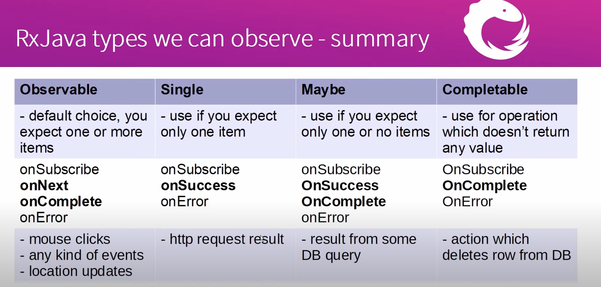
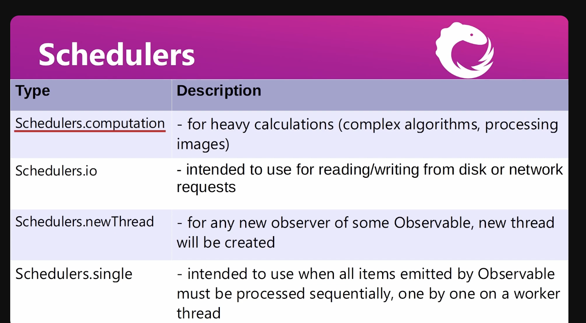
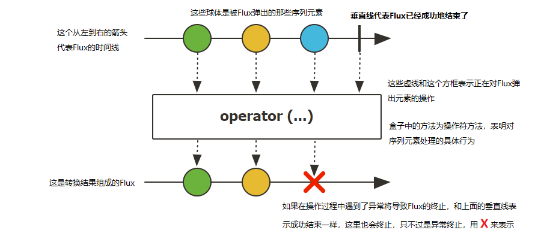
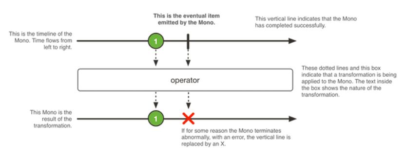
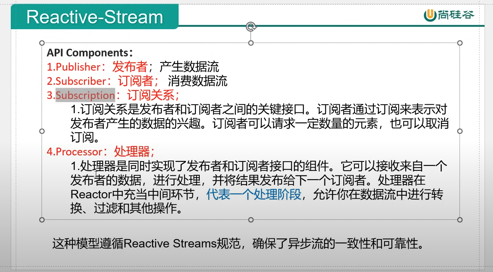
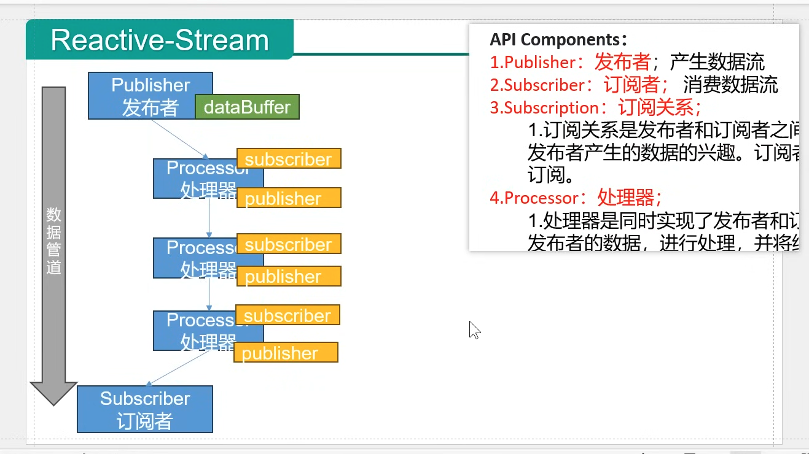

# RX Java

## Concept

- Observable type
	- https://youtu.be/l4zfIkRsT_8?si=7O7qBEwWrwGd4qnn&t=345

- Schedulers
	- https://youtu.be/4menosDtstk?si=e6JB22qoqaSwXFQa&t=440

- just
	- just()：建立Flux序列，並聲明指定資料流

- subscribe
	- 訂閱Flux序列，只有進行訂閱後才回觸發資料流，不訂閱就什麼都不會發生

- Mono VS Flux

	- Flux
		- Flux 類似 RxJava 的 Observable，它可以觸發零到多個事件，並根據實際情況結束處理或觸發錯誤。
		- Flux 具有 rx 運算子的反應式串流發佈器，它發出 0 到 N 個元素，然後完成（成功或有錯誤）。
	

	- Mono
		- Mono 最多只觸發一個事件，所以可以把 Mono 用於在非同步任務完成時發出通知。
		- Mono 是具有基本 rx 運算子的 Reactive Streams Publisher 透過 onNext 訊號最多發出一個項目，然後以 onComplete 訊號（成功的 Mono，有或沒有值）終止，或只發出一個 onError 訊號（失敗的 Mono）。不同於 Optional 的是，Optional 更像是 true/false 的結果傳回，是對有效值進行校驗。
	

	- Flux 和 Mono 都是資料流的發布者，使用Flux 和Mono 都可以發出三種資料訊號：元素值，錯誤訊號，完成訊號；錯誤訊號和完成訊號都代表終止訊號，終止訊號用於告訴訂閱者資料流結束了，錯誤訊號終止資料流同時把錯誤訊息傳遞給訂閱者。
	- https://www.cnblogs.com/crazymakercircle/p/16127013.html

- Servlet
	- Servlet（Server Applet)
	- https://github.com/yennanliu/til/blob/master/README.md#20240727

- Publisher, Subscriber, Subscription, Processer
	

	

## Ref
- video
	- https://www.youtube.com/watch?v=7mbjhNCWqvs&list=PLZ3FH0lcV0117kiek3g-qiQDkO4ezy_Ro
	- https://www.youtube.com/watch?v=EExlnnq5Grs&list=PLqq-6Pq4lTTYPR2oH7kgElMYZhJd4vOGI
- code
	- tutorial
	   	- https://github.com/taku-k/rx-spring-boot-react-starter
	   	- https://github.com/mrroin/Mrroin_Base_Backend_Java_Rx/tree/main
	   	- https://github.com/koushikkothagal/reactive-java-workshop
  	- project
  		- https://github.com/ojacquemart/spring-boot-rxjava/tree/master
  		- https://github.com/ravindraranwala/SpringBootRxJava
 
- spring boot Web Flux
  	- https://www.tpisoftware.com/tpu/articleDetails/1726
  	- https://juejin.cn/post/7129076913951211557
  	- https://ithelp.ithome.com.tw/users/20141418/ironman/4617

 - others
 	- https://ithelp.ithome.com.tw/articles/10264448
