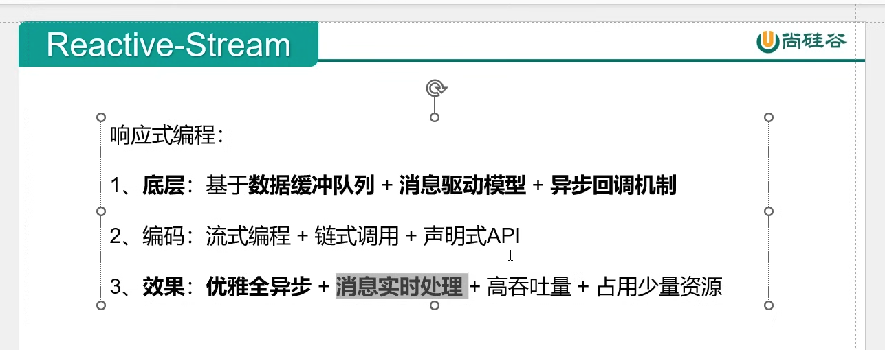

# RX Java

## Concept

- Reactive programming
	<p></p>

- Observable type
	- https://youtu.be/l4zfIkRsT_8?si=7O7qBEwWrwGd4qnn&t=345
<p></p>

- Schedulers
	- https://youtu.be/4menosDtstk?si=e6JB22qoqaSwXFQa&t=440
<p></p>

- just
	- just()：建立Flux序列，並聲明指定資料流

- subscribe
	- 訂閱Flux序列，只有進行訂閱後才回觸發資料流，不訂閱就什麼都不會發生

- Mono VS Flux

	- Flux
		- Flux 類似 RxJava 的 Observable，它可以觸發零到多個事件，並根據實際情況結束處理或觸發錯誤。
		- Flux 具有 rx 運算子的反應式串流發佈器，它發出 0 到 N 個元素，然後完成（成功或有錯誤）。
	<p></p>


	- Mono
		- Mono 最多只觸發一個事件，所以可以把 Mono 用於在非同步任務完成時發出通知。
		- Mono 是具有基本 rx 運算子的 Reactive Streams Publisher 透過 onNext 訊號最多發出一個項目，然後以 onComplete 訊號（成功的 Mono，有或沒有值）終止，或只發出一個 onError 訊號（失敗的 Mono）。不同於 Optional 的是，Optional 更像是 true/false 的結果傳回，是對有效值進行校驗。
	<p></p>

	- Flux 和 Mono 都是資料流的發布者，使用Flux 和Mono 都可以發出三種資料訊號：元素值，錯誤訊號，完成訊號；錯誤訊號和完成訊號都代表終止訊號，終止訊號用於告訴訂閱者資料流結束了，錯誤訊號終止資料流同時把錯誤訊息傳遞給訂閱者。
	- https://www.cnblogs.com/crazymakercircle/p/16127013.html


- Servlet
	- Servlet（Server Applet)
	- https://github.com/yennanliu/til/blob/master/README.md#20240727


- Publisher, Subscriber, Subscription, Processer
	<p></p>
	<p></p>

- Lambda, flatMap example:
	- https://github.com/yennanliu/JavaHelloWorld/tree/main/dev_projects/RxJava/RxJava/src/main/java/com/yen/dev

- Single
	- https://blog.csdn.net/JMW1407/article/details/121007602

- Flowable
	- https://zouzhberk.github.io/rxjava-study/

- Stream
	- https://blog.csdn.net/xiaofeng10330111/article/details/130457788
	- https://blog.csdn.net/netyeaxi/article/details/103757510
	- [rx_java_stream.md](https://github.com/yennanliu/JavaHelloWorld/blob/main/dev_projects/RxJava/doc/rxjava_stream.md)

- Blocking op (e.g. `toStream()`)
	- toStream() is blocking because it waits for all elements in the reactive pipeline to be available before iterating over them.
	- In reactive programming, blocking operations (like block(), toStream(), and Thread.sleep()) should be avoided as they break the asynchronous, non-blocking flow, reducing scalability and performance.
	- In reactive programming (like in Spring WebFlux), non-blocking operations are crucial because they allow efficient handling of I/O-bound and CPU-bound tasks without holding up the thread. Blocking operations, like toStream(), halt the thread until the operation completes, which disrupts the non-blocking, asynchronous flow.
	- Why `toStream()` is Blocking:
		- The toStream() method in a Flux (or any reactive type) is blocking because it converts the reactive stream into a Java Stream, which is inherently synchronous and pull-based. This means that when you invoke toStream(), the system waits (blocks) until all elements are available or until it reaches the end of the stream. This breaks the reactive, non-blocking behavior since it forces the application to consume all elements in a blocking, sequential manner.
		- [example code](https://github.com/yennanliu/SpringPlayground/blob/employee-system-dev007-rx-java/springEmployeeSystem/backend/EmployeeSystem/src/main/java/EmployeeSystem/service/UserService.java#L163)
	- other common blocking op
		- `block()`
		- `subscribe().get()` or `Future.get()`
		- `toIterable()`
		- Thread.sleep()
		- JDBC call 


- Difference Between Single.fromCallable() and Single.just()

	- `Single.just()`:
		- Immediately emits the result when created. It’s used when you already have the data available at the time of creating the Single.
		- If any exception occurs during the creation of the data, it will not handle it properly (it will throw the exception during creation, not during subscription).
	- `Single.fromCallable()`:
		- Defer execution until the Single is subscribed to.
		- Captures exceptions thrown during the task and forwards them as onError events, making it safer for potentially error-prone operations like IO or database access.

- When to use `Single` VS `Observable`

  - 1. Observable:

		•	Definition: Observable can emit zero or more items over time and may complete or error out.
		•	Use Case: Use Observable when you expect a stream of multiple items over time (like continuous data or events).
		•	Examples:
		•	A stream of user input events (like mouse clicks, key presses).
		•	Data streams from sensors (multiple temperature readings).
		•	A paginated API that returns multiple responses over time.
		```java
		// java
		// In this example, the Observable emits a series of integers (1, 2, 3, 4, 5), which are received one by one.

		Observable<Integer> observable = Observable.just(1, 2, 3, 4, 5);
		observable.subscribe(
		    item -> System.out.println("Received: " + item),
		    error -> System.err.println("Error: " + error),
		    () -> System.out.println("Done!")
		);
		```

  - 2. Single:

		•	Definition: Single is a specialized type that emits exactly one item or an error. It doesn’t emit multiple items or stay active after sending its single response.
		•	Use Case: Use Single when you expect exactly one item or a result, such as when you are making a network request or querying a database for a single value.
		•	Examples:
		•	Fetching a single user profile from a database.
		•	Making an HTTP request to retrieve a specific resource.
		•	Computing a single result (e.g., mathematical calculation).
		```java
		// java
		// In this example, Single emits only one item ("Hello World") and completes.


		Single<String> single = Single.just("Hello World");
		single.subscribe(
		    item -> System.out.println("Received: " + item),
		    error -> System.err.println("Error: " + error)
		);
		```
	- When to Use Single vs. Observable?

		- Use Single when:
			•	You need a single response or value.
			•	The operation you are performing can either succeed or fail and provides only one result.
			•	Example use cases:
			•	HTTP requests where you expect a single result (e.g., fetching one user profile).
			•	Database queries that return one row or one value.
		- Use Observable when:
			•	You expect to work with a stream of multiple items.
			•	The operation can emit zero, one, or more items.
			•	You want to respond to real-time events or handle streams of data over time.
			•	Example use cases:
			•	Streams of user interactions (button clicks, gestures).
			•	Data streams from a continuous source (e.g., a sensor).
			•	Paginated responses from an API.

	- Summary:

		•	Single is for operations that will emit one item or an error.
		•	Observable is for operations that can emit zero or more items (it could be continuous or a finite sequence).

	- Choosing between Single and Observable depends on the type of data you are working with and the result you expect from the operation.


## Ref
- video
	- https://www.youtube.com/watch?v=7mbjhNCWqvs&list=PLZ3FH0lcV0117kiek3g-qiQDkO4ezy_Ro
	- https://www.youtube.com/watch?v=EExlnnq5Grs&list=PLqq-6Pq4lTTYPR2oH7kgElMYZhJd4vOGI
- code
	- tutorial
	   	- https://github.com/taku-k/rx-spring-boot-react-starter
	   	- https://github.com/mrroin/Mrroin_Base_Backend_Java_Rx/tree/main
	   	- https://github.com/koushikkothagal/reactive-java-workshop
  	- project
  		- https://github.com/ojacquemart/spring-boot-rxjava/tree/master
  		- https://github.com/ravindraranwala/SpringBootRxJava
 
- spring boot Web Flux
  	- https://www.tpisoftware.com/tpu/articleDetails/1726
  	- https://juejin.cn/post/7129076913951211557
  	- https://ithelp.ithome.com.tw/users/20141418/ironman/4617

 - others
 	- https://ithelp.ithome.com.tw/articles/10264448
